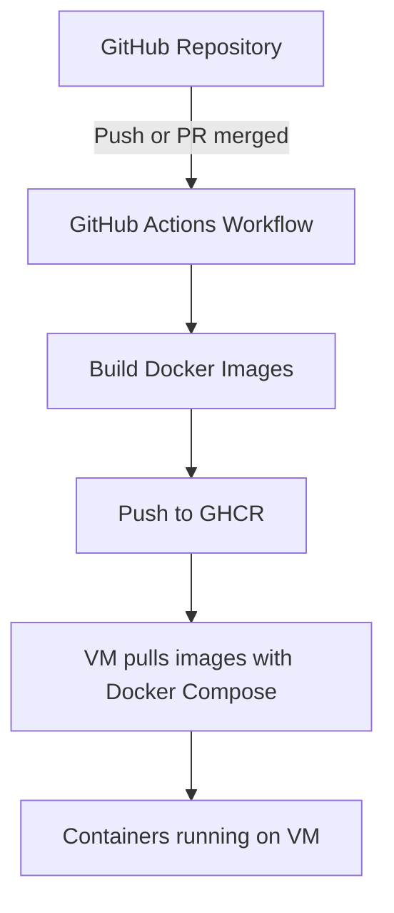

# Conduit Docker Project

This repository contains a Docker Compose setup for running the Conduit application, including a Django backend and an Angular frontend.  
The project is designed to be easy to deploy, with persistent data storage and configurable environment variables.

## Table of Contents
- [Quickstart](#quickstart)
- [Usage](#usage)
    - [Environment Variables](#environment-variables)
    - [Volumes](#volumes)
    - [Restarting and Stopping Containers](#restarting-and-stopping-containers)
- [Security](#security)
- [GitHub Actions Deployment](#github-actions-deployment)
- [Extras](#extras)

## Quickstart

### Prerequisites
- Docker
- Docker Compose
- GitHub Actions enabled (for automated build & deployment)

### Steps
1. Clone this repository:
```bash
git clone git@github.com:A-Marbach/conduit-container.git
cd conduit-container
```
2. Initialize submodules (backend and frontend):

```bash
git submodule update --init --recursive
```
3. Copy the example environment file:

```bash
cp backend/.env.example backend/.env
```

4. Build the containers:

```bash
docker-compose build --no-cache
docker-compose up -d
```

5. Open the application in your browser:
* Frontend: `http://<your_vm_ip>:8282`
* Backend API: `http://<your_vm_ip>:5000/admin/`


## Usage

Navigate to the frontend URL to use the Conduit application.

The backend API is available at /api/.

Make sure all environment variables are correctly set before starting.

## Environment Variables

You can modify .env files or the environment: section in docker-compose.yaml for a secure deployment:

```
| Variable           | Description                       | Default                     |
|--------------------|-----------------------------------|-----------------------------|
| DJANGO_SECRET_KEY  | Django secret key                 | changeme                    |
| DATABASE_NAME      | Name of the PostgreSQL/SQLite DB  | conduit                     |
| DATABASE_USER      | Database username                 | user                        |
| DATABASE_PASSWORD  | Database password                 | password                    |
| DATABASE_HOST      | Database host                     | db                          |
| DATABASE_PORT      | Database port                     | 5432                        |
```
## Volumes

* backend_data: Stores backend data (if any persistent storage is needed)

* frontend_data: Stores frontend build files

Volumes ensure data persists even after container restarts or recreation.

### Restarting and Stopping Containers

Restart and Stopping containers:
```bash
docker-compose restart
docker-compose down
```
## Security
* Do not commit .env files, SSH keys, passwords, or any sensitive information to the repository.
* Do not include IP addresses or credentials in the frontend code.


## GitHub Actions Deployment

The new deployment workflow uses GitHub Actions to:

1. Build backend & frontend images

2. Push them to GitHub Container Registry (GHCR)

3. Update containers on the VM via Docker Compose

> **Note:** The VM no longer builds images itself – it only pulls the pre-built images from GHCR.

* Workflow file: .github/workflows/deployment.yaml
* Requirements: SSH key & GHCR Personal Access Token stored as repository secrets.

#### Deployment Flow



### Extras

* You can add additional frontend features or backend apps as needed.


> **Note:**  
> Edit the `.env` files if you want custom credentials.  
> Do **not** commit `.env` files to the repository, as they contain sensitive information.
