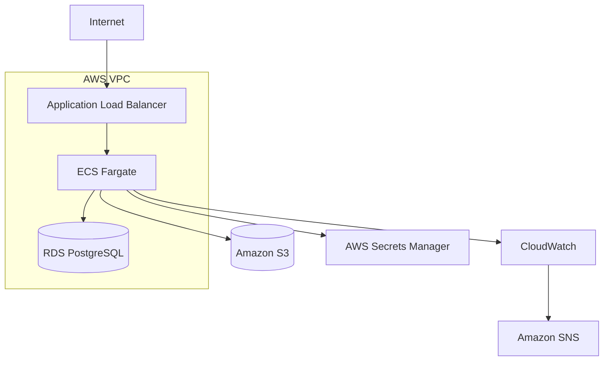

# Vikunja on AWS ECS Fargate

AWS infrastructure for running Vikunja on Amazon ECS Fargate, provisioned with Terraform.

This project demonstrates cloud infrastructure operations, private networking, persistent storage, secrets management, monitoring, backup and recovery, failure testing and Infrastructure as Code.

## Table of Contents

* [Architecture](#architecture)
* [Tech Stack](#tech-stack)
* [Infrastructure & Networking](#infrastructure--networking)
* [Security](#security)
* [Persistence](#persistence)
* [Monitoring & Alerting](#monitoring--alerting)
* [Backup & Recovery](#backup--recovery)
* [Failure Testing](#failure-testing)
* [Terraform](#terraform)
* [CI Pipeline](#ci-pipeline)
* [Project Structure](#project-structure)
* [Validation](#validation)
* [Skills Demonstrated](#skills-demonstrated)
* [Status](#status)

## Architecture



The Application Load Balancer is the public entry point.

ECS Fargate tasks and RDS PostgreSQL run in private subnets and are not directly exposed to the internet.

## Tech Stack

| Category               | Technology                                     |
|------------------------|------------------------------------------------|
| Compute                | Amazon ECS Fargate                             |
| Load Balancing         | Application Load Balancer                      |
| Database               | Amazon RDS PostgreSQL                          |
| Storage                | Amazon S3                                      |
| Networking             | AWS VPC, public & private subnets, NAT Gateway |
| Security               | Security Groups, IAM, AWS Secrets Manager      |
| Monitoring             | CloudWatch Logs, CloudWatch Alarms             |
| Notifications          | Amazon SNS                                     |
| Cost Monitoring        | AWS Budgets                                    |
| Infrastructure as Code | Terraform                                      |
| CI                     | GitHub Actions                                 |

## Infrastructure & Networking

The AWS network architecture separates public ingress from private application and database resources.

### Public Layer

* Application Load Balancer
* NAT Gateway

### Private Layer

* ECS Fargate tasks
* RDS PostgreSQL

Incoming HTTP traffic reaches the Application Load Balancer, which forwards requests to the ECS service on port `3456`.

ECS tasks use the NAT Gateway for outbound internet access without requiring public IP addresses.

## Security

Security measures are implemented through network isolation, Security Groups, IAM permissions and AWS Secrets Manager.

* ECS tasks have no public IP addresses
* RDS is not publicly accessible
* Only the ALB accepts public application traffic
* ALB-to-ECS traffic is restricted by Security Groups
* PostgreSQL port `5432` is only accessible from ECS
* S3 public access is blocked
* Sensitive configuration is stored in AWS Secrets Manager
* IAM permissions are limited to required AWS resources

The container image is pinned to a specific SHA256 digest instead of using `latest`, providing reproducible deployments.

## Persistence

Persistent application data is stored outside the ECS task lifecycle.

| Data             | AWS Service    |
| ---------------- | -------------- |
| Application data | RDS PostgreSQL |
| File attachments | Amazon S3      |

This allows ECS tasks to be stopped, replaced or recreated without losing database data or uploaded files.

## Monitoring & Alerting

AWS CloudWatch is used for application logs, infrastructure metrics and operational alerting.

Configured alarms include:

* ECS CPU utilization
* ECS memory utilization
* ALB unhealthy targets
* ALB target 5xx errors
* RDS CPU utilization
* RDS free storage

Alarm state changes are delivered by email through Amazon SNS.

AWS Budgets is configured for monthly cost monitoring.

More details: [docs/monitoring.md](docs/monitoring.md)

## Backup & Recovery

Database backup and recovery were validated using an RDS snapshot restore test.

Test scenario:

1. Created test data in Vikunja
2. Created an RDS snapshot
3. Deleted the test data
4. Restored the snapshot to a temporary RDS instance
5. Connected Vikunja to the restored database
6. Verified that the deleted data was recovered

The recovery test confirmed that application data could be successfully restored from an RDS snapshot.

More details: [docs/backup-restore.md](docs/backup-restore.md)

## Failure Testing

### ECS Task Recovery

The running ECS task was manually stopped to simulate a container failure.

ECS automatically started a replacement task and restored application availability.

### S3 Persistence

An attachment was uploaded to Vikunja and verified in Amazon S3.

After stopping and replacing the ECS task, the attachment remained available.

This confirmed that uploaded files remained persistent across ECS task replacement.

## Terraform

Terraform defines and manages the AWS infrastructure used by the application environment.

```bash
cd terraform

terraform init
terraform fmt
terraform validate
terraform plan
terraform apply
```

Infrastructure can be removed with:

```bash
terraform destroy
```

Terraform state is stored remotely in an encrypted and versioned S3 backend with state locking.

## CI Pipeline

GitHub Actions performs automated Terraform formatting and configuration validation on repository changes.

```text
Push / Pull Request
        |
        v
terraform fmt -check -recursive
        |
        v
terraform init -backend=false
        |
        v
terraform validate
```

Infrastructure deployment remains manual to keep changes controlled.

Workflow:

```text
.github/workflows/terraform.yml
```

## Project Structure

```text
.
├── .github/
│   └── workflows/
│       └── terraform.yml       # Terraform CI validation
│
├── docs/                       # Architecture, deployment and operations documentation
│   ├── architecture.md
│   ├── backup-restore.md
│   ├── deployment.md
│   ├── monitoring.md
│   └── troubleshooting.md
│
├── terraform/                  # AWS infrastructure definitions
│   ├── alb.tf
│   ├── budget.tf
│   ├── ecs.tf
│   ├── iam.tf
│   ├── monitoring.tf
│   ├── networking.tf
│   ├── outputs.tf
│   ├── provider.tf
│   ├── rds.tf
│   ├── s3.tf
│   ├── secrets.tf
│   ├── security.tf
│   ├── sns.tf
│   └── variables.tf
│
└── README.md
```

## Validation

The following infrastructure components and operational scenarios were deployed, tested and verified:

* Terraform deployment
* Infrastructure teardown and rebuild
* ECS automatic task recovery
* RDS persistence
* S3 attachment persistence
* RDS snapshot recovery
* CloudWatch monitoring
* SNS email alerting
* AWS cost monitoring
* Terraform CI validation
* Remote Terraform state


## Skills Demonstrated

* AWS Infrastructure Operations
* Amazon ECS Fargate
* AWS VPC Networking
* Terraform
* IAM and Security Groups
* AWS Secrets Manager
* Amazon RDS PostgreSQL
* Amazon S3
* CloudWatch Monitoring and Alerting
* Backup and Recovery
* Failure Testing and Service Recovery
* GitHub Actions
* Remote Terraform State

## Status

Infrastructure deployment, testing and operational validation completed.

The AWS resources were destroyed after testing to avoid unnecessary ongoing costs.
