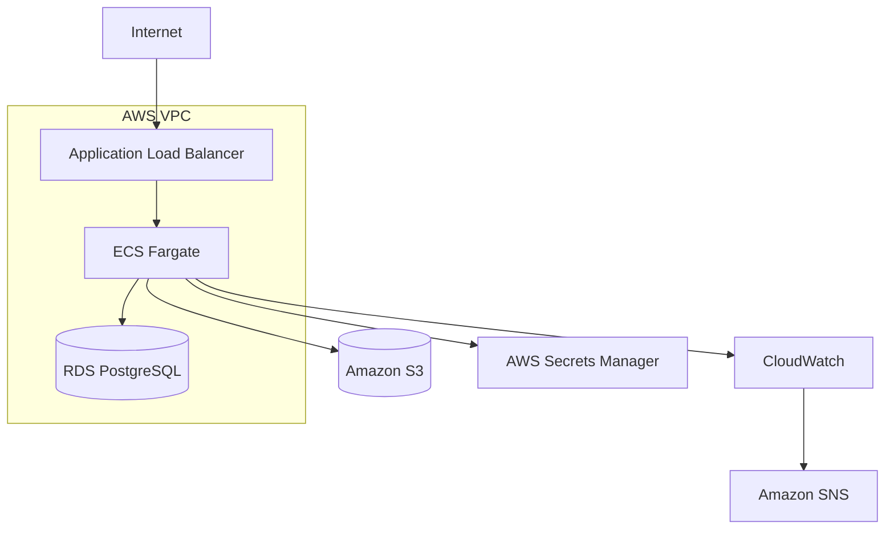

# Vikunja on AWS ECS Fargate

Production-oriented AWS infrastructure project for running **Vikunja on Amazon ECS Fargate**, fully provisioned with **Terraform**.

The project demonstrates a containerized AWS architecture with private networking, persistent storage, secrets management, monitoring, backup and recovery, failure testing, and Infrastructure as Code.

## Table of Contents

* [Architecture](#architecture)
* [Tech Stack](#tech-stack)
* [Infrastructure & Networking](#infrastructure--networking)
* [Security](#security)
* [Persistence](#persistence)
* [Monitoring & Alerting](#monitoring--alerting)
* [Backup & Recovery](#backup--recovery)
* [Failure Testing](#failure-testing)
* [Terraform](#terraform)
* [CI Pipeline](#ci-pipeline)
* [Validation](#validation)
* [Possible Improvements](#possible-improvements)

## Architecture



```text
Internet
   |
   v
Application Load Balancer :80
   |
   v
ECS Fargate :3456
   |
   +--> RDS PostgreSQL :5432
   |
   +--> Amazon S3
```

The Application Load Balancer is the public entry point.

ECS Fargate tasks and RDS PostgreSQL run in private subnets and are not directly exposed to the internet.

## Tech Stack

* Amazon ECS Fargate
* Application Load Balancer
* Amazon RDS PostgreSQL
* Amazon S3
* AWS VPC
* Public & private subnets
* NAT Gateway
* Security Groups
* IAM
* AWS Secrets Manager
* CloudWatch Logs & Alarms
* Amazon SNS
* AWS Budgets
* Terraform
* GitHub Actions

## Infrastructure & Networking

The infrastructure separates public access from private application resources.

### Public Layer

* Application Load Balancer
* NAT Gateway

### Private Layer

* ECS Fargate tasks
* RDS PostgreSQL

Incoming HTTP traffic reaches the Application Load Balancer, which forwards requests to the ECS service on port `3456`.

ECS tasks use the NAT Gateway for outbound internet access without requiring public IP addresses.

## Security

Security is enforced through network isolation, Security Groups, IAM and AWS Secrets Manager.

* ECS tasks have no public IP addresses
* RDS is not publicly accessible
* Only the ALB accepts public application traffic
* ALB-to-ECS traffic is restricted by Security Groups
* PostgreSQL port `5432` is only accessible from ECS
* S3 public access is blocked
* Sensitive configuration is stored in AWS Secrets Manager
* IAM permissions are limited to required AWS resources

The container image is pinned to a specific SHA256 digest instead of using `latest`, providing reproducible deployments.

## Persistence

Persistent application data is stored outside the ECS container.

| Data             | AWS Service    |
| ---------------- | -------------- |
| Application data | RDS PostgreSQL |
| File attachments | Amazon S3      |

This allows ECS tasks to be replaced without losing application data or uploaded files.

## Monitoring & Alerting

CloudWatch collects application logs and monitors infrastructure health.

Configured alarms include:

* ECS CPU utilization
* ECS memory utilization
* ALB unhealthy targets
* ALB target 5xx errors
* RDS CPU utilization
* RDS free storage

Alarm state changes are delivered by email through Amazon SNS.

AWS Budgets is configured for monthly cost monitoring.

More details: [docs/monitoring.md](docs/monitoring.md)

## Backup & Recovery

Database recovery was tested using an RDS snapshot.

Test scenario:

1. Created test data in Vikunja
2. Created an RDS snapshot
3. Deleted the test data
4. Restored the snapshot to a temporary RDS instance
5. Connected Vikunja to the restored database
6. Verified that the deleted data was recovered

The test confirmed that the database could be successfully restored from backup.

More details: [docs/backup-restore.md](docs/backup-restore.md)

## Failure Testing

### ECS Task Recovery

The running ECS task was manually stopped to simulate a container failure.

ECS automatically started a replacement task and restored the application service.

### S3 Persistence

An attachment was uploaded to Vikunja and verified in Amazon S3.

After stopping and replacing the ECS task, the attachment remained available.

This confirmed that persistent files were independent of the ECS container lifecycle.

## Terraform

Terraform manages the AWS infrastructure.

```bash
cd terraform

terraform init
terraform fmt
terraform validate
terraform plan
terraform apply
```

Infrastructure can be removed with:

```bash
terraform destroy
```

Terraform state is stored remotely in an encrypted and versioned S3 backend with state locking.

## CI Pipeline

GitHub Actions automatically validates the Terraform configuration on repository changes.

```text
Push / Pull Request
        |
        v
terraform fmt -check -recursive
        |
        v
terraform init -backend=false
        |
        v
terraform validate
```

Infrastructure deployment remains manual to keep changes controlled.

Workflow:

```text
.github/workflows/terraform.yml
```

## Project Structure

```text
.
├── .github/
│   └── workflows/
│       └── terraform.yml
│
├── docs/
│   ├── architecture.md
│   ├── backup-restore.md
│   ├── deployment.md
│   ├── monitoring.md
│   └── troubleshooting.md
│
├── terraform/
│   ├── alb.tf
│   ├── budget.tf
│   ├── ecs.tf
│   ├── iam.tf
│   ├── monitoring.tf
│   ├── networking.tf
│   ├── outputs.tf
│   ├── provider.tf
│   ├── rds.tf
│   ├── s3.tf
│   ├── secrets.tf
│   ├── security.tf
│   ├── sns.tf
│   └── variables.tf
│
└── README.md
```

## Validation

The following components and operational scenarios were deployed and tested:

* Terraform deployment
* Infrastructure teardown and rebuild
* ECS automatic task recovery
* RDS persistence
* S3 attachment persistence
* RDS snapshot recovery
* CloudWatch monitoring
* SNS email alerting
* AWS cost monitoring
* Terraform CI validation
* Remote Terraform state

## Possible Improvements

* HTTPS with AWS Certificate Manager
* Route 53 custom domain
* ECS Auto Scaling
* Multi-AZ RDS
* Higher backup retention
* Separate dev, staging and production environments

## Status

Infrastructure implementation and operational validation completed.

The AWS resources were destroyed after testing to avoid unnecessary ongoing costs.
